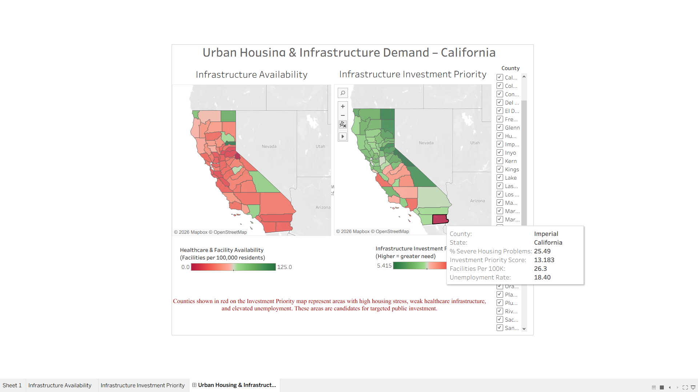
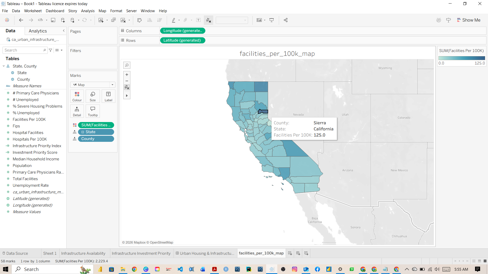
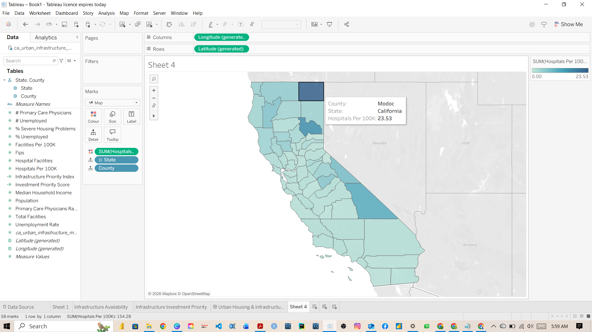
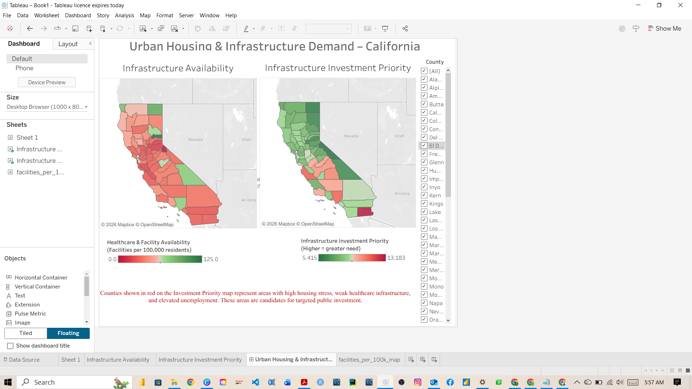

---

# Urban Housing & Infrastructure Demand Analytics (California)

This project analyzes **housing stress and access to essential infrastructure across California counties** using real public datasets and spatial analysis in Tableau.

The goal was to identify **where infrastructure investment would have the highest impact**, based on population pressure, housing conditions, employment stress, and access to facilities.

**Focus areas:** housing, healthcare access, education infrastructure
**Tools:** Tableau, Excel, SQL-style data modeling
**Geography:** California (county level)

---

## Repository Overview

```
├─ data/
│  ├─ raw/                  # original public datasets
│  └─ processed/            # cleaned & merged dataset
│
├─ tableau/                 # Tableau workbook
├─ images/                  # dashboard screenshots
├─ sql/                     # logical schema & queries
└─ README.md
```

Key links:

* 📊 **Clean dataset:**
  [`data/processed/ca_urban_infrastructure_master_2025.csv`](data/processed/ca_urban_infrastructure_master_2025.csv)

* 📈 **Tableau dashboard:**
  [`tableau/urban_infrastructure_dashboard.twbx`](tableau/urban_infrastructure_dashboard.twbx)

* 🗺️ **Visuals used below:**
  [`images/`](images/)

---

## 1. Business Problem

State and local governments face a recurring challenge:

* Population grows unevenly
* Infrastructure investment lags or clusters
* Housing stress rises in specific regions

This project answers three operational questions:

1. **Which counties are most under-served relative to population?**
2. **Where do housing stress and weak infrastructure overlap?**
3. **Which counties should be prioritized first when funding is limited?**

---

## 2. Data Sources (Public)

All datasets are publicly available and recent:

* **Population & Housing**

  * County Health Rankings (2025)
  * Severe Housing Problems (%)

* **Employment**

  * California Labor Force & Unemployment Statistics

* **Healthcare Infrastructure**

  * California Health Facilities datasets
  * Aggregated to hospitals per county

* **Education Infrastructure**

  * NCES / ElSi public school data
  * Aggregated to county level

Raw files are preserved in [`data/raw/`](data/raw/)
Final merged dataset is in [`data/processed/`](data/processed/)

---

## 3. Data Preparation & Merging

Steps performed:

1. Standardized county names and identifiers
2. Aggregated facilities and hospitals by county
3. Normalized infrastructure metrics per population
4. Merged datasets into a single county-level table

Final dataset columns include:

* `County`
* `Population`
* `Facilities Per 100K`
* `Hospitals Per 100K`
* `Unemployment Rate`
* `Severe Housing Problems (%)`

---

## 4. Key Calculations

All metrics were designed to allow **fair comparison across counties**.

### Infrastructure Normalization

```
Facilities Per 100K = (Facilities / Population) * 100,000
Hospitals Per 100K  = (Hospitals / Population) * 100,000
```

### Investment Priority Score (Tableau calculated field)

This score combines multiple stress indicators into one ranking metric:

```
(1 / [Facilities Per 100K]) * 0.4
+ [Unemployment Rate] * 0.3
+ [Severe Housing Problems (%)] * 0.3
```

* Higher score = higher investment need
* Used only for **ranking and comparison**, not absolute judgment

---

## 5. Tableau Dashboard & Maps

### Investment Priority Map



* Red counties indicate **highest priority for investment**
* Green counties indicate **lower relative need**

This view is meant for **decision-makers**, not analysts.

---

### Facilities per 100k Residents



Shows how unevenly basic services are distributed relative to population.

---

### Hospitals per 100k Residents



Highlights healthcare access gaps that are not obvious from raw counts.

---

### Dashboard Overview



The dashboard includes:

* County-level tooltips
* Interactive filtering
* Clear legends for non-technical users

---

## 6. Insights

Key observations from the analysis:

* Several counties show **high housing stress and weak infrastructure simultaneously**
* Normalized metrics reveal gaps hidden by population size
* Some mid-sized counties face **greater relative strain** than large metro areas

This type of analysis supports:

* Infrastructure prioritization
* Grant allocation
* Capital planning decisions

---

## 7. Why This Project Belongs in My Portfolio

This project reflects how I approach real analytical work:

* Start from a **planning or engineering question**
* Use **real, imperfect data**
* Normalize metrics to avoid misleading conclusions
* Build visuals that support **policy and investment decisions**

It aligns directly with roles in:

* Urban & infrastructure analytics
* Public-sector data analysis
* Real estate & development analytics
* Operations and planning teams

---
